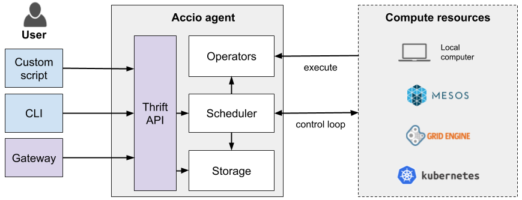

This section provides a system-oriented view over the Accio architecture.
Reading this section should give a understanding the various parts Accio is made of, but is not required for just using it.

Here is the big picture about the components of Accio and the way they interact.

The most important component the **agent**.
It is a process in charge of handling users' requests.
The agent speaks the [Thrift protocol](https://thrift.apache.org/), which provides an IDL to define typed messages and RPC services.
Users mainly use the **client** to communicate with the agent, which is a CLI application.

The agent contains three internal pluggable components.
The **operators** are the building blocks of Accio.
Each operator is basically a function performing a specific task, e.g., downloading a dataset or applying some transformation on it.
Accio comes with a library of [built-in operators](operators/) designed to study location privacy, but it is possible to [add your own operators](../contribute/custom-operator.html).
The **scheduler** is in charge of handling the actual execution of those operators.
Accio comes with a basic local scheduler, executing the operators as sub-processes, but it is possible to integrate external computing clusters such as Kubernetes or Grid Engine.
We rely on existing and battle-proofed technology to launch and monitor operators, allowing Accio to focus on its specificity: workflows management.
The **storage** is responsible for persisting information about workflows and runs.
It can be an SQL database such as MySQL or PostgreSQL, or a distributed NoSQL store such as Cassandra or Elasticsearch.

The **gateway** is a simple server that speak the HTTP protocol.
It basically make the translation between Thrift and HTTP.
For now, it only provides a read-only access to Accio, meaning it is not possible to create runs or workflows through it.
It also optionally comes with a Web interface, allowing to browse Accio data in a convenient way.
This component is optional, although recommended because it greatly simplifies the usage of Accio, especially for non-technical users.
