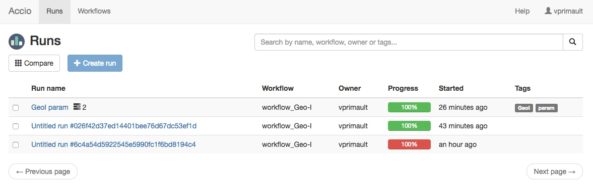
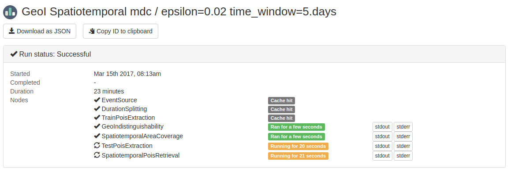
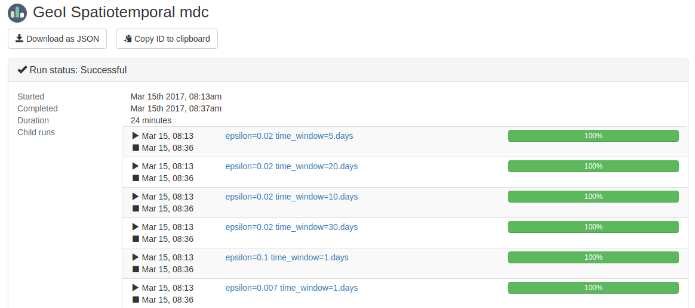

Runs can take some time to complete, especially if you launched a complex parameter sweep.
Fortunately, Accio provides you real-time feedback about execution.

* TOC
{:toc}

## Tracking progress with the Web UI

Runs can be browsed through the Web interface.
There is even a search field at the top of the list, allowing to search across different fields such as owner, run name or tags.



Each run has a dedicated page.
Among other information, the first box displays execution progress, including timing information and progress of individual nodes.
Each node can be either waiting (e.g., for dependent nodes to complete or for compute resources to be available), running or completed (either successfully or not).
Moreover, some nodes can never be executed if their is an appropriate value available from a previous execution of the same operator with the same inputs; this is a *cache hit*.



This was the view for a single or child run.
Parent runs, that are the origin for parameter sweeps, display slightly different information.
Because they are not actually executed, they do not have nodes but instead child runs.
Each run displays timing information and overall progress (i.e., the percentage of completed nodes).



## Tracking progress with the CLI

Runs can also be explored through the CLI application.
The [`accio get` command](commands/get.html) allows to search among runs.
The following command returns all active (i.e., actually executing) runs:
```bash
accio get runs
```

You can also access already completed runs by adding the `-all` flag, and further refine your search with other flags.
For example, the following command retrieve all your past runs:
```bash
accio get runs -all -owner=$USER
```

Then, the [`accio describe` command](commands/describe.html) is used to get more detailed information about a resource.
This gives access to the exact same information than the Web interface.
For example, this is the same parent run than previously, obtained from the CLI application (some information has been stripped).

```
Id              1dfd4a42aec045239874d5034bbd0a57
Workflow        workflow_Geo-I_split:001cb63f007476b764861c5d224070361f0ec5fd
Status          Success
Started         2 weeks ago
Completed       2 weeks ago
Duration        1446 seconds

Child Runs
  ID                                CREATED          NAME             STATUS
  041035602ee2483bbc6c6bdb8d25057a  2 weeks ago      epsilon=0.02 ti  Success
  259d2ab1241c4b6aa50f59766db15acb  2 weeks ago      epsilon=0.02 ti  Success
  db26af5fd1a34383a36c3e9c295d2b18  2 weeks ago      epsilon=0.02 ti  Success
  2614a593952e40948b859172c06071c3  2 weeks ago      epsilon=0.02 ti  Success
  854899520e58419da8c0c17a4f680c93  2 weeks ago      epsilon=0.1 tim  Success
  109094f3b486491491d88e452edb1875  2 weeks ago      epsilon=0.007 t  Success
```

This was the result for a parent run.
The same command applied to a child or single run gives a different view (some information has been stripped).

```
Id              041035602ee2483bbc6c6bdb8d25057a
Parent Id       1dfd4a42aec045239874d5034bbd0a57
Workflow        workflow_Geo-I_split:001cb63f007476b764861c5d224070361f0ec5fd
Status          Running
Started         23 minutes ago
Duration        23 minutes

Nodes
  Node name                       Status     Duration
  EventSource                     Success    <cache hit>
  DurationSplitting               Success    <cache hit>
  TrainPoisExtraction             Success    <cache hit>
  GeoIndistinguishability         Success    4608 milliseconds
  SpatiotemporalAreaCoverage      Success    3263 milliseconds
  TestPoisExtraction              Running    20190 milliseconds
  SpatiotemporalPoisRetrieval     Running    21437 milliseconds
```

## Cancelling a run

Sometimes, you may want to cancel a run, for example because you made a mistake while specifying it and there is no reason to waste resources by executing it.
This is possible with the [`accio kill` command](commands/kill.html).
It will cause any node being executed to be cancelled and the whole run execution to be immediatly stopped.
It is not a nice way to stop a run, it is similar to sending a `SIGKILL` to a Unix process.

The run will still be viewable through usual tools.
If you want to entirely get a rid of a run, you can use the [`accio delete` command](commands/delete.html) to remove it from the history.
Be careful, this cannot be undone!
