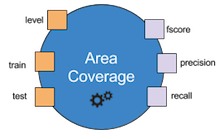
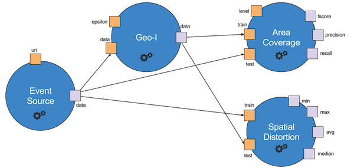

* TOC
{:toc}

## Operators
Operators are the basic building block of Accio.
They can be viewed as a function in a program: given some inputs, they produce some outputs.
Each operator comes with a very clearly defined interface: it defines the inputs it consumes and the outputs it produces, using a type system provided by Accio.
Inputs and outputs are sometimes referred to as *ports*, which can refer either to an input or output.
Inputs may be defined as optional (i.e., the operator can be executed even if the input is not defined) or have a default value (i.e., this default value will be used if the input is not defined).
Input and outputs have a type, enabling the engine to enforce values are correct before running operators.
Input (resp. output) names must be unique among all inputs (resp. outputs) of a given operator;
however nothing prevents an input and an output to have the same name, as in the exemple above.
Inputs can have a default value that will be used if none is explicitly specified.
Operators have a name, which must be unique across all operators registered in Accio.

  

  
  

  The above operator is named `AreaCoverage`.
  It has three input ports, `level`, `train` and `test`, and three output ports, `fscore`, `precision` and `recall`.
  The exact specification of each operator can be found in the [operators library](../../reference/library/).

Generally speaking, operators are assumed to be deterministic.
It means that given some inputs, they are expected to produce the exact same outputs at each execution.
We support randomness through *unstable operators*.
Operators can be defined as unstable.
This unstable status can be defined depending on some inputs, but should be known before actually executing the operator.
Unstable operators are allowed to used a seed they have access to through the operator execution context.
This seed can be considered as an additional input and should be their only source of randomness.
It means that given **a set of inputs and a seed**, unstable operators are expected to produce the exact same outputs at each execution.

## Workflows
A workflow is a directed acyclic graph, whose nodes are instances of operators.
It specifies how the various operators are interconnected.
Indeed, node inputs can either be specified through a constant value or come from the output of another node.
In the latter case, there will be a dependency between the two nodes.
Workflows have a name, that uniquely identifies them through a cluster, and have an owner, usually the person who created them.

  

  
  

  The above workflow is formed of four nodes, each with its own inputs (in orange) and outputs (in purple).
  The `EventSource` node is the root node (i.e., it has no input from another node).
  It produces one output, `data`, that is then consumed as an input by nodes `Geo-I`, `AreaCoverage` and `SpatialDistortion`.
  It becomes clear that some inputs are filled from the output of another node (e.g, the `data` input of `Geo-I`), while some other are directly specified through a constant (e.g, the `epsilon` input of `Geo-I`).

Each node has a name, that should be unique among all nodes of a workflow.
By default, the node name is the name of the operator it is an instance of.
However, you can freely give a node another name.
It is even required if you want to have multiple instances of the same operator inside a workflow, as node names are unique.

Each input must be filled with a value.
When it is not provided by the output of another node, it can be specified either by a static constant, given when creating the workflow, or by a dynamic parameter.
Parameters are workflow-level inputs; they are specified only at run time by the user.
They have a name, a type and possibly a default value.
They allow the user to vary the value of one or several inputs that take their value from that given parameter.
It means a given parameter can be used by multiple ports, though they obviously need to be of the same data type.

When executed, workflows collect the outputs generated by every operator inside the graph, that are then called *artifacts*.
They also collect some execution metrics, that are not directly generated by the operators but instead gathered by profilers.
These metrics are used to provide additional information about the execution, such as the duration or the memory consumption.

## Runs
A run is a particular instantiation of a workflow, where all required parameters have been clearly defined.
It embeds some additional metadata, such as a name, some tags and an owner.
Every run is identified by a globally unique run identifier, which is required to monitor its state or access its results later.

When experimenting, you may be in the situation where you want to test many parametrization of a given workflow.
Thankfully, Accio provides an easy way to perform this, via parameter sweeps.
In this case, a parent run will be created to hold a reference to all child runs.
In this case, the parent run contains nothing to be executed, it is the child runs that will actually be executed.
The parent run identifier is still useful to reference all its children as a whole.
All commands that accept a run identifier work seamlessly whether it is a parent, child or single run.
For instance, if you export a parent run, it will in fact export all its children.
