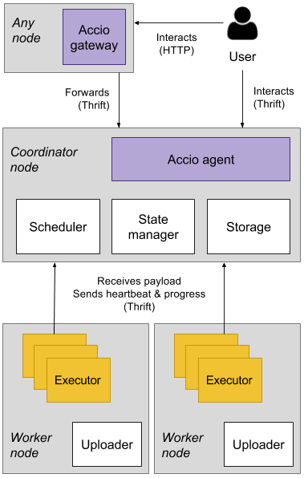

This section provides a system-oriented view over the Accio architecture.
Reading this section should give a understanding the various parts Accio is made of, but is not required for just using it.

## Overview

Here is the big picture about the components of Accio and the way they interact.

The most important component the **Accio agent**.
Agents are processes in charge of handling users' wills.
Accio is designed around a very simple architecture, where there is no master or slave process.
One or several agents can be launched and will answer users' requests.
It is made possible because agents are stateless; persistent state is managed by storage and state manager plugins, with which agents interact.
Agents speak the [Thrift protocol](https://thrift.apache.org/), which provides an IDL to define typed messages and RPC services.
Users use the **Accio client** to communicate with the agent, which is a CLI application.

The **Accio gateway** is a simple server that speak the HTTP protocol.
It basically make the translation between Thrift and HTTP.
For now, it only provides a read-only access to Accio, meaning it is not possible to create runs or workflows through it.
It also optionally comes with a [Web interface](web-ui.html), allowing to browse Accio data in a convenient way.

Finally, an **Accio executor** is a process launched on a worker node that will actually execute operators.
Executors are responsible for downloading data needed by an operator, processing it according its inputs and then upload produced data.
They communicate with agents to inform them of their progress, which allows to have almost real-time feedback on run execution.
It is important to note that there is no resident Accio process running on worker nodes, waiting for requests from the agent.
Instead, executors are dynamically launched and killed with an orchestration system, such as Kubernetes or Nomad.
We rely on existing and battle-proofed technology to launch and monitor executors, allowing Accio to focus on its specificity: workflows management.
Moreover, it allows Accio to be easily integrated into an existing multi-tenant infrastructure.

## Plugins

All the white boxes in the above schema represent pluggable parts, that can be easily swapped.
Accio comes with several implementations for each of them, allowing a system administrator to fine tune a cluster according to specific needs.
It also provides for each of them a "local" version that can be used to quickly bootstrap a single-node Accio instance, ideal for development or testing.

**Scheduler** plugins control lifecycle of executors.
It is provided by orchestration system such as Mesos, Kubernetes or Nomad.

**Storage** plugins provide persistent storage capabilities for data such as workflows and runs.
It could an SQL database such as MySQL or PostgreSQL or a distributed database such as Cassandra or Elasticsearch.

**State manager** plugins provide short-lived storage capabilities for data such as run progress.
It also provides a solution for inter-process locking, that is used by Accio agents to synchronize.
It could be a generic key/value store such as Consul or Redis, or a system specifically designed for coordination such as Zookeeper. 

**Uploader** plugins provide a way to persist binary data generated by the execution of operators that would otherwise be lost, as executors are sandboxed.
It is typically used to store datasets produced by operators.
It could be any distributed filesystem such as NFS or GlusterFS or a blob store such as S3.
At this point, you may be wondering why there is no downloader plugin.
In fact there is a downloader in the Accio architecture, but it is not designed to be pluggable (more exactly it is not configurable).
The rationale is that an executor uses a single uploader to store generated data, but the downloader must be generic enough to download data stored by any uploader.
For example, if at some point executors store their data on S3 instead of NFS, we still want to be able to retrieve the old data still on NFS.
This is why we do not seed the downloader as a plugin, although it must of course evolve as we add new uploaders.