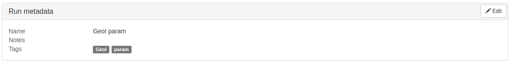

This page presents the concept of runs, which are instances of workflows, and how to work with them.

## Authoring a run

Similarly to workflows, runs are created with their own definition language, based on [JSON](https://en.wikipedia.org/wiki/JSON).
Each run is described in its own file.
For example, a simple run of the `geoind_workflow` could be modeled with the following definition:

```json
{
  "workflow": "geoind_workflow",
  "params": {
    "epsilon": {"value": "0.0001"},
    "uri": {"value": "/path/to/my/dataset"}
  }
}
```

The minimal amount of information needed is the name of the workflow to launch, and values for required parameters (i.e., those for which no default is available).
It is also possible to set metadata on a run: a name, some notes and tags.

```json
{
  "workflow": "geoind_workflow",
  "name": "My first workflow",
  "notes": "Keeping track of some very important decisions I made",
  "tags": ["awesome_dataset", "geoind"],
  "params": {
    "epsilon": {"value": "0.0001"},
    "uri": {"value": "/path/to/my/dataset"}
  }
}
```

Run metadata are indexed and useful to organize and look for runs.
As the number of runs in your cluster will be increasing, it will become more and more important to be able to quickly find the interesting one.
Some additional metadata are automatically recorded, such as the run owner (i.e., the user who created it) and the time at which it was created.
Whereas runs are immutable after being created, their metadata can be freely updated at any moment, while the run is running or after it completed.
Please note that child runs do not have their own metadata (i.e., name, notes and tags).
Instead they inherit metadata of their parent.
It means that even if you update metadata of a child run, it will actually update metadata of the parent run.
Moreover, child runs have a name that is automatically generated after the combination of parameters that produced them;
that name cannot be modified.

There are cases where we need to test many different parametrizations of a workflow.
Fortunately, this is very easily doable with Accio, thanks to a flexible definition of parameters.

```json
{
  "workflow": "geoind_workflow",
  "repeat": 3,
  "name": "My brand new experiment",
  "tags": ["brand", "new"],
  "params": {
    "epsilon": {
      "from": 0.00001,
      "to": 1,
      "log": true
    },
    "uri": {"values": ["/path/to/my/dataset", "/path/to/another/dataset"]}
  }
}
```

In this above example, the `epsilon` parameter will take values for 0.00001 to 1 following a logarithmic progression, while the `uri` parameter will take two different values corresponding to two different datasets.
A parent run will be created, associated with a child run for each combination of parameters.
More precisely, `epsilon` will successively take values 0.0001, 0.001, 0.01, 0.1 and 1, and `uri` the two values provided in the definition, for a total of 10 different combinations of values.
Moreover, each combination of parameters will be repeated three times, because of the `repeat` field.
At the end, this run definition ends up giving birth to 30 different runs, all belonging to a parent run.
Repeating a workflow several times is especially useful in the presence of unstable operators.
In this particular workflow, the `GeoIndistinguishability` operator is unstable, and will hence produce different outputs each time it is executed.

It can be rather difficult to deal with unstable operators, because of their randomness that can break the results reproducibility.
This is why Accio comes with a way to manage this randomness, through seeds.
By default, a random seed is generated and given to unstable operator at each execution.
But it is possible to specify a custom seed in a `seed` field of a run definition, thus controlling the randomness of operators.
Generated seeds are accessible when viewing a run through the command-line or Web interface, allowing to reuse it in further experiments.
It is particularly useful to "fix" randomness while testing other variations of parameters in presence of unstable operators.

```json
{
  "workflow": "geoind_workflow",
  "seed": "120482382048",
  "params": {
    "epsilon": {"value": "0.0001"},
    "uri": {"value": "/path/to/my/dataset"}
  }
}
```

The above run definition guarantees that results will be the same at each execution, despite the presence of the `GeoIndistinguishability` unstable operator in the workflow.

:mag: The reference section contains [the specification of the run definition language](run-dsl.html).
{: .note}

## Submitting a run
Once a run has been defined, it can be submitted to the cluster with the [`accio submit` command](commands/submit.html):
```bash
accio submit path/to/my/run.json
```

If all went well, the command will give you a run identifier that you can use to monitor its progress or access its results.
If the run definition was invalid, the run will not be created and you will be given information about what was wrong.

Runs can also be created without even writing a run definition.
In fact, all fields can be specified directly as command-line arguments.
For example, the first single run can be submitted with the following command:
```bash
accio submit geoind_workflow epsilon=0.0001 uri=/path/to/my/dataset
```

The first argument is the name of the workflow, and then parameters under the form `name=value`.
You can also provide even more flags:
```bash
accio submit -name="My first workflow" -tags=awesome_dataset,geoind geoind_workflow epsilon=0.0001 uri=/path/to/my/dataset
```

However, this short form does not allow to specify parameter sweeps.
In this case, run definitions still have to be used.
Flags can even be combined with a run definition file, allowing to override some of its properties.
```bash
accio submit -repeat=2 -tags=more,tags path/to/my/run.json epsilon=0.01
```

In this invocation, the first argument is a path to a run definition file, and further arguments are parameters overrides.
With this particular form, the workflow that is launched cannot be overriden.
Command-line flags take precedence over the run definition file.

## Editing run metadata
Currently, the only way to edit run metadata after its creation is through the Web interface.
When viewing details of a run, the *Edit* button opens a dialog box allowing to modify these values.
Remind that only single and parent runs have metadata; child runs re-use metadata of their parents.



## Internals

This part contains additional information to better understand Accio internals.

### Outputs memoization
Accio comes with a very powerful memoization system, that allows it to keep track of previously generated artifacts and reuse them.
In practice, it means that when executing twice the same operator with the same parameters, the operator will actually be executed only once, each further execution reusing the outputs of the previous execution.
Ultimately, if a user launches a run that matches the same definition again and again, all subsequent executions will be (almost) instantaneous.
Still, you should not abuse of this feature, as the outputs of the base run are still copied for the new run, hence consuming additional storage space.

This memoization supports unstable operators too, by taking into account the seed that was used to generate the outputs.
A previous output of an operator will only be reused if the inputs **and the seed** were the same.

### Scheduling model
The execution of runs is parallelized across the cluster, at the node level.
If means that each node is scheduled and executed independently.
When submitting a run, the workflow is analysed to find the root nodes, which are ready to be immediately scheduled.
If enough resources are available in the cluster, their execution starts immediately.
Otherwise, they are queued, waiting for resources to be released.
It works in a first arrived, first served basis, but still at the node level.
In other words, the execution of all runs progresses in parallel, instead of a started run having the priority over not-yet-started runs.
As a result, especially in small clusters, it is encouraged to look at the actual workload before submitting a run, especially if it is large (e.g., a huge parameter sweep).
