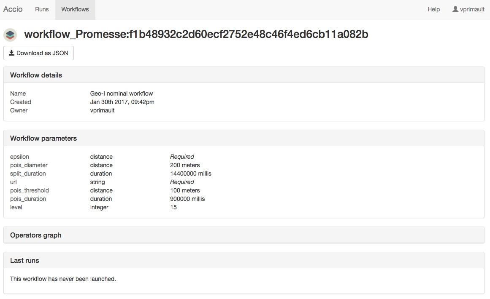
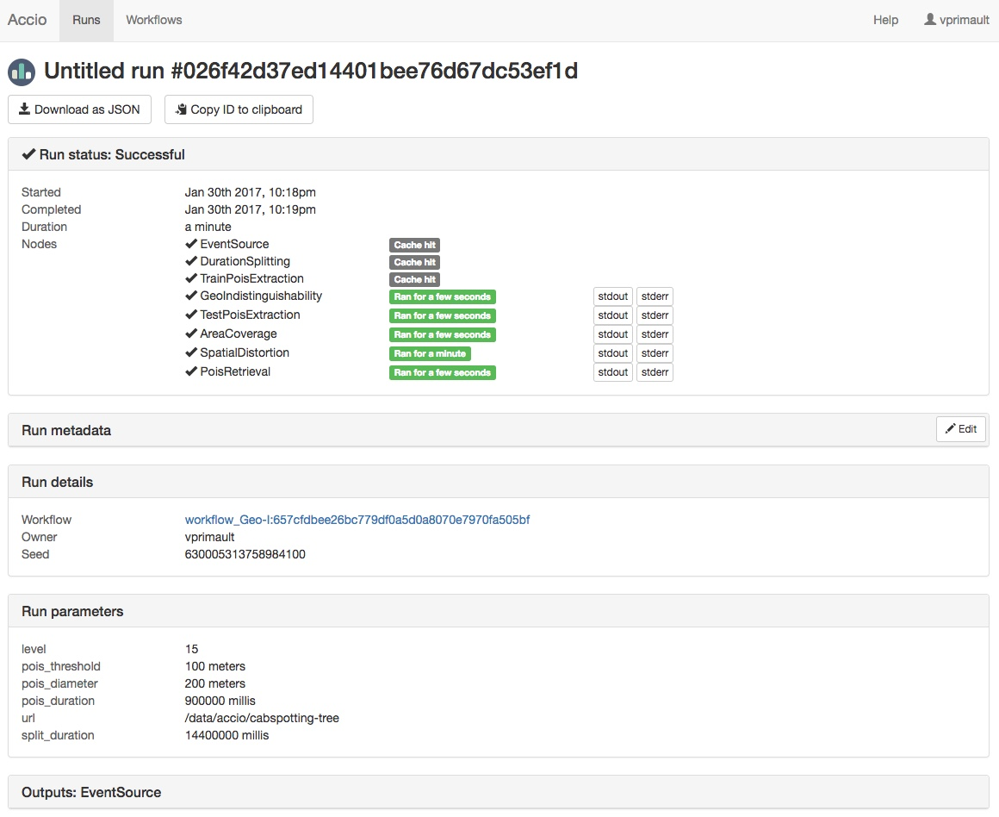
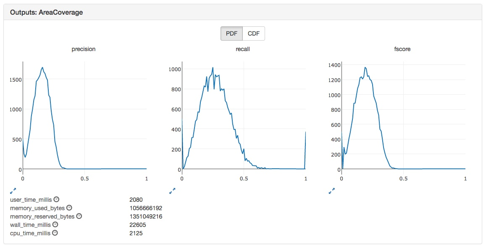

Accio comes with an intuitive Web interface, as part of the gateway component.
It allows to do almost the same operations that can be done via the [CLI application](commands/index.html).

* TOC
{:toc}

## Workflows list

## Workflow view

## Runs list

## Run view

