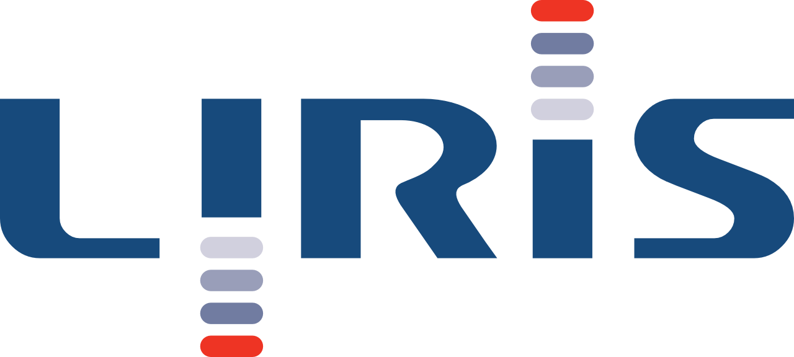
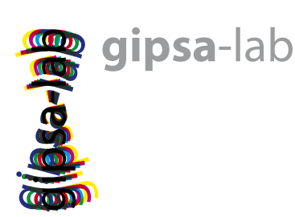

  
  

Accio is a research project developed at the [LIRIS laboratory](https://liris.cnrs.fr) (Lyon, France).
It originated from the [Priva'Mov project](https://privamov.liris.cnrs.fr), whose purpose was to collect mobility data in order to study location privacy.
Accio is currently being used by the [DRIM team](https://liris.cnrs.fr/drim/) at the LIRIS and by the [SYSCO team](http://www.gipsa-lab.grenoble-inp.fr/sysco/accueil-sysco.php) at the [GIPSA laboratory](http://www.gipsa-lab.fr/) (Grenoble, France).

## Publications

Sophie Cerf, Bogdan Robu, Nicolas Marchand, Antoine Boutet, Vincent Primault, et al.
Toward an Easy Configuration of Location Privacy Protection Mechanisms.
In *Proceedings of Middleware Posters and Demos*, Dec 2016, Trento, Italy. 2016.
&lt;[hal-01376640](https://hal.archives-ouvertes.fr/hal-01376640)&gt;

Vincent Primault, Antoine Boutet, Sonia Ben Mokhtar and Lionel Brunie.
ALP: Adaptive Location Privacy.
In *Proceedings of the 35h Symposium on Reliable Distributed Systems (SRDS)*, September 2016, Budapest, Hungary.
&lt;[hal-01370447](https://hal.archives-ouvertes.fr/hal-01370447)&gt;

This work was supported by the [LABEX IMU](http://imu.universite-lyon.fr) (ANR-10-LABX-0088) of Université de Lyon, within the program "Investissements d'Avenir" (ANR-11-IDEX-0007) operated by the French National Research Agency (ANR).

## Contributing
Bugs and suggestions can be reported on [our GitHub issues tracker](https://github.com/privamov/accio/issues).
You will need to create an account on GitHub first.
We also welcome contributions under the form of [pull requests](https://github.com/privamov/accio/pulls).
If you want to get started with developping Accio, there is even [a guide for you](../extend/developping/)!

## Presentations
* **2017-01-27:** [LIRIS team seminar](resources/liris_2017-01-27.pdf)
