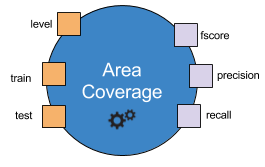
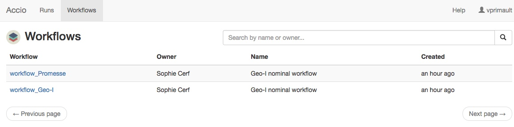

This page presents the concept of workflows, which are templates of experiments, and how to work with them.
The next section is about [how to instantiate a workflow](runs.html), in order to actually execute it.

* TOC
{:toc}

## Presentation of operators & workflows
Operators are the basic building block of Accio.
They can be viewed as a function in a program: given some inputs, they produce some outputs.
Each operator comes with a very clearly defined interface: it defines the inputs it consumes and the outputs it produces, using a type system provided by Accio.
Inputs and outputs are sometimes referred to as *ports*, which can refer either to an input or output.
Inputs may be defined as optional (i.e., the operator can be executed even if the input is not defined) or have a default value (i.e., this default value will be used if the input is not defined).
Input and outputs have a type, enabling the engine to enforce values are correct before running operators.
Input (resp. output) names must be unique among all inputs (resp. outputs) of a given operator;
however nothing prevents an input and an output to have the same name, as in the exemple above.
Inputs can have a default value that will be used if none is explicitly specified.
Operators have a name, which must be unique across all operators registered in Accio.

<div class="well" markdown="1">
  <div class="center" markdown="1">
  
  </div>
  The above operator is named `AreaCoverage`.
  It has three input ports, `level`, `train` and `test`, and three output ports, `fscore`, `precision` and `recall`.
  The exact specification of each operator can be found in the [operators library](../../reference/library/).
</div>

Generally speaking, operators are assumed to be deterministic.
It means that given some inputs, they are expected to produce the exact same outputs at each execution.
We support randomness through *unstable operators*.
Operators can be defined as unstable.
This unstable status can be defined depending on some inputs, but should be known before actually executing the operator.
Unstable operators are allowed to used a seed they have access to through the operator execution context.
This seed can be considered as an additional input and should be their only source of randomness.
It means that given **a set of inputs and a seed**, unstable operators are expected to produce the exact same outputs at each execution.

A workflow is a directed acyclic graph, whose nodes are instances of operators.
It specifies how the various operators are interconnected.
Indeed, node inputs can either be specified through a constant value or come from the output of another node.
In the latter case, there will be a dependency between the two nodes.
Workflows have a name, that uniquely identifies them through a cluster, and have an owner, usually the person who created them.

<div class="well" markdown="1">
  <div class="center" markdown="1">
  
  </div>
  The above workflow is formed of four nodes, each with its own inputs (in orange) and outputs (in purple).
  The `EventSource` node is the root node (i.e., it has no input from another node).
  It produces one output, `data`, that is then consumed as an input by nodes `Geo-I`, `AreaCoverage` and `SpatialDistortion`.
  It becomes clear that some inputs are filled from the output of another node (e.g, the `data` input of `Geo-I`), while some other are directly specified through a constant (e.g, the `epsilon` input of `Geo-I`).
</div>

Each node has a name, that should be unique among all nodes of a workflow.
By default, the node name is the name of the operator it is an instance of.
However, you can freely give a node another name.
It is even required if you want to have multiple instances of the same operator inside a workflow, as node names are unique.

Each input must be filled with a value.
When it is not provided by the output of another node, it can be specified either by a static constant, given when creating the workflow, or by a dynamic parameter.
Parameters are workflow-level inputs; they are specified only at run time by the user.
They have a name, a type and possibly a default value.
They allow the user to vary the value of one or several inputs that take their value from that given parameter.
It means a given parameter can be used by multiple ports, though they obviously need to be of the same data type.

When executed, workflows collect the outputs generated by every operator inside the graph, that are then called *artifacts*.
They also collect some execution metrics, that are not directly generated by the operators but instead gathered by profilers.
These metrics are used to provide additional information about the execution, such as the duration or the memory consumption.

## Viewing existing workflows
Workflows must be registered to a cluster before being instantiated.
They are shared among Accio users, which means that you should first start by verifying if there is not already a workflow defined for what you want to do.

Workflows are searchable with the [`accio get` command](../../reference/commands/get.html).

```bash
$ accio get workflows
```

Like other objects, they can be filtered by owner, and the total number of results limited.
For example, to retrieve 5 workflows belonging to John Doe:

```bash
$ accio get workflows -owner=jdoe -n=5
```

Workflows can also be browsed and searched through the Web interface, accessible at the HTTP endpoint of the Accio gateway.



The advantage of the web interface is that you can have a graphical representation of an existing workflow, which is not possible through the command-line application.
Clicking on a node will display additional informations, such as its inputs and the nodes it is connected with.
This interface is very useful to understand a graph, especially it is large, or debug a graph that is not behaving as expected.


## Authoring a workflow
Operators are a system-level blocks: they need to be implemented by developers, who define their interface (i.e., their inputs and outputs).
You cannot add a new operator without coding it.

<div class="alert alert-info" markdown="1">
:sunglasses: If you are a developper and want to create a custom operator, [there is a guide for that](../../extend/custom-operator/)!
</div>

Fortunately, workflows can be defined by non-programmers thanks to the workflow definition language, which is based on [JSON](https://en.wikipedia.org/wiki/JSON).
Each workflow is described into its own file.
For example, the above example workflow could be modeled with the following definition:

```json
{
  "id": "geoind_workflow",
  "name": "Geo-indistinguishability workflow",
  "owner": "jdoe <john.doe@gmail.com>",
  "params": [
    {
      "name": "epsilon",
      "kind": "double",
      "default_value": 0.01
    },
    {
      "name": "uri",
      "kind": "string"
    }
  ],
  "graph": [
    {
      "op": "EventSource",
      "inputs": {
        "url": {"param": "uri"}
      }
    },
    {
      "op": "GeoIndistinguishability",
      "name": "Geo-I",
      "inputs": {
        "epsilon": {"param": "epsilon"},
        "data": {"reference": "EventSource/data"}
      }
    },
    {
      "op": "AreaCoverage",
      "inputs": {
        "level": {"value": 15},
        "train": {"reference": "EventSource/data"},
        "test": {"reference": "Geo-I/data"}
      }
    },
    {
      "op": "SpatialDistortion",
      "inputs": {
        "train": {"reference": "EventSource/data"},
        "test": {"reference": "Geo-I/data"}
      }
    }
  ]
}
```

We observe that this workflow has two parameters, `uri`, which is the URI to the source dataset and must be specified, and `epsilon`, which is the noise of the geo-indistinguishability algorithm and has a default value of 0.01.
Note that in the above example, the `Geo-I` node is renamed, although it was not necessary;
here it is only for conciseness (typing "GeoIndistinguishability" multiple times without doing any mistake is not an easy task!).

Only node inputs have to be specified, node outputs are automatically inferred from inputs.
Three manners of specifying inputs become apparent:

  * through a statically specified value, e.g., the `level` input port of the `Coverage` node;
  * through a parameter, e.g., the `url` input port of the `Source` node depends on the `uri` parameter;
  * through a reference to the output of another node, e.g., the `train` input port of the `Coverage` node depends on the `data` output of the `EventSource` node.
  References are specified with an absolute name, formed of a node name and an output name, separated by a slash, e.g., `Geo-I/data`.
  * through its default value.
  The input's default value is only used if:
    * if nothing is specified in the workflow concerning this input; or
    * if the input is associated with a parameter that
      1. does not have a default value, and
      2. is associated only with inputs having a default value, and
      3. is not specified by the user at run time.

If both a parameter and an input have default values, the parameter's default value will be used.

Each workflow has a unique identifier, the `id` field in the definition language.
This identifier is very important because it will have to be specified later when creating runs.
By default, it falls back to the name of the file inside which the workflow is defined (without its extension).

<div class="alert alert-info" markdown="1">
  :mag: The reference section contains [the specification of the workflow definition language](../../reference/workflow-dsl/).
</div>

## Publishing a workflow
Once you have written your new workflow, or created a new version of an existing workflow, you need to make it available to the Accio cluster.
This is done with the [`accio push` command](../../reference/commands/push.html).

```bash
$ accio push path/to/my/workflow.json
```

If the workflow definition was invalid, the workflow will not be created (or updated) and you will be given information about what was wrong.

If you push a workflow which already exists (based on the `id` field), a new version of it will be created.
It means that you have to be very careful not overriding an existing workflow by mistake.

Each time a workflow is pushed, a version number is automatically assigned to it by Accio.
Versioning workflows allows past runs to reference workflows at previous versions.
It is useful to examine the workflows that was actually executed, even if it has been updated in-between.
For the same reason, it is not possible to delete a workflow that has some runs associated to it.
